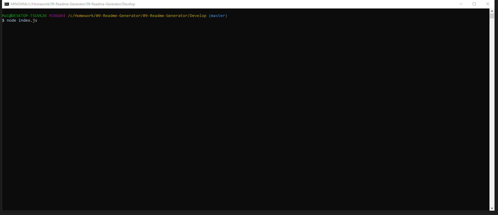

# Good Readme Generator

## About the project


A command-line application that prompt user for some information about their github project, and generate a README.md with the basic format and information entered.

---

## Getting started
Below are the prerequisite understanding and programs that were utilized :
* Visual Studio Code-click [here](https://code.visualstudio.com/) to a tutorial to install
* Github repository-click [here](https://help.github.com/en/github/)
* node.js and its file system [here](https://nodejs.org/en/)
* inquirer [here](https://www.npmjs.com/package/inquirer)
* utility [here](https://www.npmjs.com/package/utility)

---

## Code spotlight

The code snippet below demonstrate how to create a synchronous call of function.
```js
{

    async function init () {
        try{
            const data = await promptUser();
            console.log(data)
            const markdown = generateMarkdown(data);
            await writeFileAsync("README_Generator.md", markdown);
            console.log(`yay! wrote to markdown.md`)
        } catch(err){
            console.log(err)
        }
    };
}
```
## Demo




---

## Deployed link

[Live site](https://mtbanh.github.io/09-Readme-Generator/)


---

## Author

**Mai Banh**
- [Link to Github](https://github.com/mtbanh)
- [Link to LinkedIn](https://www.linkedin.com/in/mai-banh-311ba6164/)

See also the list of [contributors](https://github.com/your/project/contributors) who participated in this project.

## Acknowledgments
Thank you to my tutor, Matthew Chen.